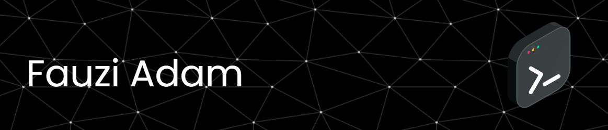

  

<h1 align="center" style="color: white">Hello World! 👋, I'm Fauzi Adam</h1>

Full Stack Web Developer & Mobile App Developer

  
  
  

<h3 style="color: white">🧘 About Me</h3>

- 🏀 My hobby is playing basketball  
- 📚 Currently learning [**Next.js**](https://nextjs.org/docs) and [**Laravel**](https://laravel.com/docs)  
- 📩 Reach me at: [fauziadam0811@gmail.com](mailto:fauziadam0811@gmail.com)  
- 🎯 Focused on: **Next.js**, **UI/UX**, and **Database Development**

##

<h3 style="color: white">💻 Languages</h3>

<h3 style="color: white">🚀 Frameworks & Library</h3>

<h3 style="color: white">🎨 Design</h3>

##

<h3 style="color: white">🧩 My Stats</h3>

 

